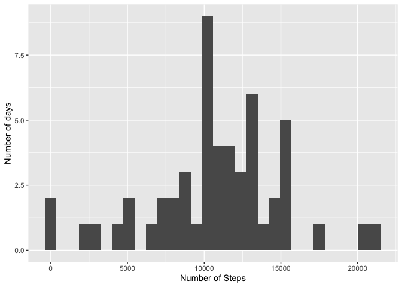
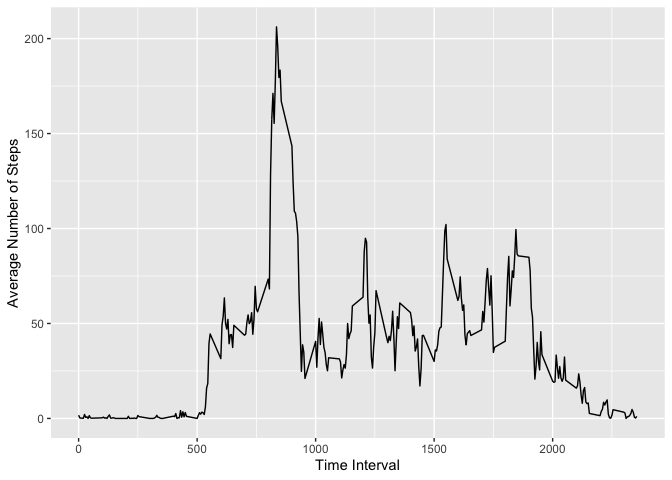
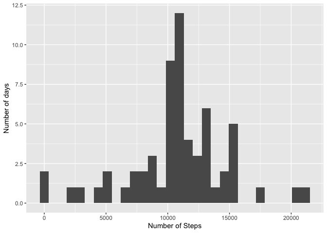
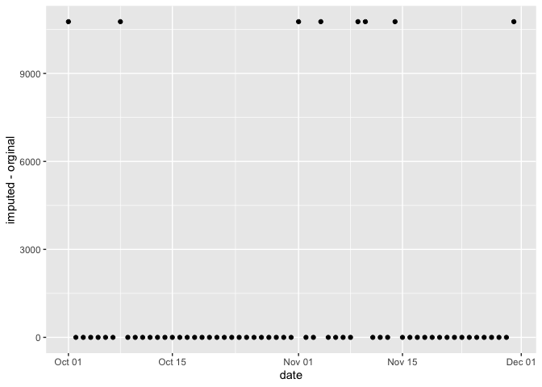
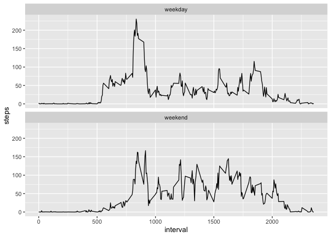

## Set Global Options

```r
knitr::opts_chunk$set(echo = TRUE)
```


## Loading and preprocessing the data

```r
unzip("activity.zip")
raw_data <- read.csv("activity.csv")
```

## What is mean total number of steps taken per day?

```r
library(dplyr)
```

```
## 
## Attaching package: 'dplyr'
```

```
## The following objects are masked from 'package:stats':
## 
##     filter, lag
```

```
## The following objects are masked from 'package:base':
## 
##     intersect, setdiff, setequal, union
```

```r
library(tidyr)
library(ggplot2)
raw_data$date <- as.Date(raw_data$date, "%Y-%m-%d")
steps_per_day <- aggregate(steps ~ date, raw_data, sum)
qplot(steps_per_day$steps, geom = "histogram", xlab="Number of Steps", ylab="Number of days")
```

```
## `stat_bin()` using `bins = 30`. Pick better value with `binwidth`.
```

<!-- -->

```r
daily_mean <- mean(steps_per_day$steps)
daily_mean
```

```
## [1] 10766.19
```

```r
daily_median <-median(steps_per_day$steps)
daily_median
```

```
## [1] 10765
```


## What is the average daily activity pattern?

```r
avg_steps_time <- aggregate(steps ~ interval, raw_data, mean)
qplot(interval, steps, data=avg_steps_time, geom="line", xlab="Time Interval", ylab="Average Number of Steps")
```

<!-- -->

```r
avg_steps_time[which.max(avg_steps_time$steps), 1]
```

```
## [1] 835
```


## Imputing missing values

```r
sum(is.na(raw_data$steps)) #count total number of NAs
```

```
## [1] 2304
```

```r
new_raw_data <- raw_data  #make a copy of the raw data

for (i in 1:nrow(new_raw_data)) {
      if(is.na(new_raw_data[i,1])) {
            new_raw_data[i,1] <- avg_steps_time[which(avg_steps_time$interval==new_raw_data[i,3]), 2]
      }
}
#draw a histogram out of the new data
new_steps_per_day <- aggregate(steps ~ date, new_raw_data, sum)
qplot(new_steps_per_day$steps, geom = "histogram", xlab="Number of Steps", ylab="Number of days")
```

```
## `stat_bin()` using `bins = 30`. Pick better value with `binwidth`.
```

<!-- -->

```r
new_daily_mean <- mean(new_steps_per_day$steps)
new_daily_mean
```

```
## [1] 10766.19
```

```r
new_daily_median <- median(new_steps_per_day$steps)
new_daily_median
```

```
## [1] 10766.19
```

```r
diff_mean <- new_daily_mean - daily_mean  #cacluate the difference in mean
diff_mean  
```

```
## [1] 0
```

```r
diff_median <- new_daily_median - daily_median #cacluate the difference in median
diff_median
```

```
## [1] 1.188679
```

```r
#What is the impact of imputing missing data on the estimates of the total daily number of steps?
new_steps_per_day <- aggregate(steps ~ date, new_raw_data, sum)
diff_steps_per_day <- merge(new_steps_per_day, steps_per_day, by.x="date", by.y="date", all=TRUE)
diff_steps_per_day[is.na(diff_steps_per_day)] <- 0
diff_steps_per_day <- diff_steps_per_day %>% mutate(diff = steps.x - steps.y)
ggplot(diff_steps_per_day, aes(date, diff)) + geom_point() + labs(y="imputed - orginal")
```

<!-- -->

## Are there differences in activity patterns between weekdays and weekends?


```r
#create a factor column
weekends <- c("Saturday", "Sunday")
new_raw_data <- new_raw_data %>% mutate(day = weekdays(date))
new_raw_data$factor <- as.factor(ifelse(new_raw_data$day %in% weekends, "weekend", "weekday"))

#plot results
weekend_data <- aggregate(steps ~ interval + factor, new_raw_data, mean)
ggplot(weekend_data, aes(interval, steps)) + geom_line() + facet_wrap(~factor, ncol=1, nrow=2)
```

<!-- -->

